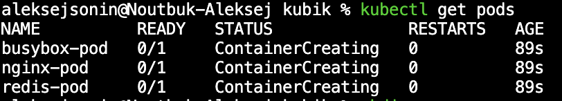
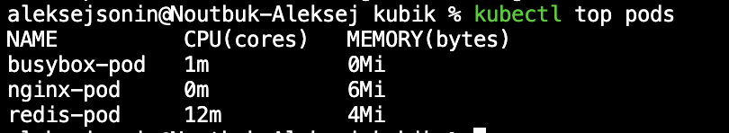
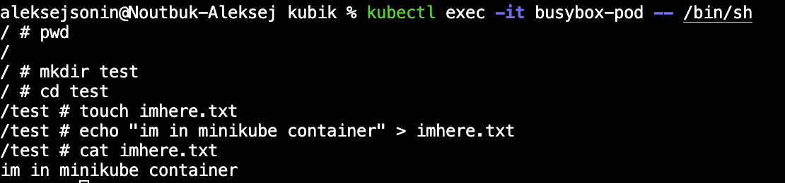
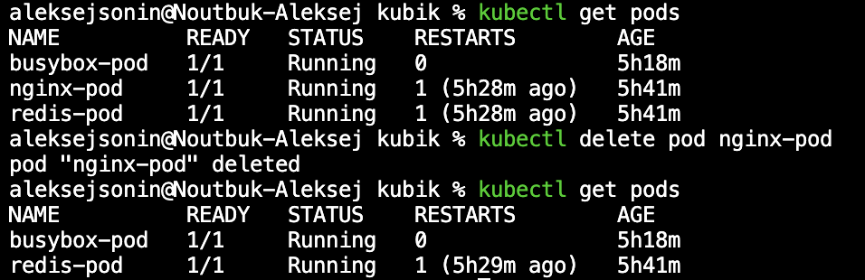

# labMinikube

## Часть 1

### Создаем несколько манифестов для подов(в репе это nginx, busybox и redis)
Пример yaml-манифеста:
```yaml
# подик для кубика 

apiVersion: v1
kind: Pod
metadata:
  name: nginx-pod
  labels:
    name: nginx
spec:
  containers:
  - name: nginx-container
    image: nginx:alpine
    resources:
      limits:
        memory: "128Mi"
        cpu: "500m"
      requests:
        memory: "64Mi"
        cpu: "250m"
    ports:
      - containerPort: 80

```
Далее запускаем кластер minikube и запускаем поды
```bash
minikube start
#ждем загрузки образов 
kubectl apply -f pod1.yaml -f pod2.yaml -f pod3.yaml
#проверим состяоние подовт
kubectl get pods
```
Состояние подов после создания:


Посмортим утилизацию по подам, для этого установим утилиту metrics-server 
```bash
minikube addons enable metrics-server 
kubectl top pods    
```
Утилизация памяти и ядер после запуска подов:


Посмотрим логи контейнеров, вывод отправим в отдельную директорию
```bash
kubectl logs nginx-pod > logs/nginx-logs.log && \
kubectl logs busybox-pod > logs/busybox-logs.log && \
kubectl logs redis-pod > logs/redis-logs.log
```

Подключимся к контейнеру с busybox:
```bash 
kubectl exec -it busybox-pod -- /bin/sh
```
Для примера создадим директорию и текстовый файла


Теперь остановим под с контейнером:



## Часть 2 

### Создадим dockerfile для образа контейнера с линуксом и автозапуском apache 
```dockerfile
FROM registry.access.redhat.com/ubi8/ubi-minimal:8.8

COPY init.sh /usr/local/bin/

WORKDIR /app

RUN chmod +x /usr/local/bin/init.sh

EXPOSE 80

CMD ["/usr/local/bin/init.sh"]
```

Исполняемый скрипт init.sh:

```bash
#!/bin/bash
microdnf install -y httpd && \
    microdnf clean all && rm -rf /var/cache/yum

mkdir -p /var/www/html && \
    chown -R apache:apache /var/www && \
    chown -R 755 /var/www


echo "This is Aleksei Sonin from index.html" > /var/www/html/index.html

exec httpd -DFOREGROUND

```
Сделаем образ: 
```bash 
docker build -t apache-cont .
```

Запустим контейнер из сделанного раннее образа:
```bash 
docker run -d -p 8080:80 apache-cont 
```

В браузере введем http://localhost:8080 и увидим сообщение которое мы оставили в index.html

